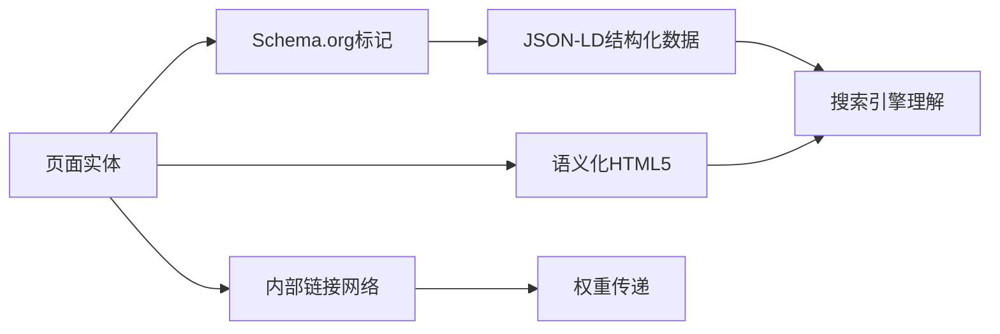
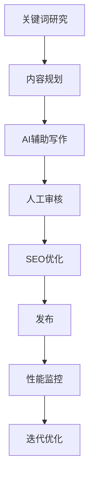
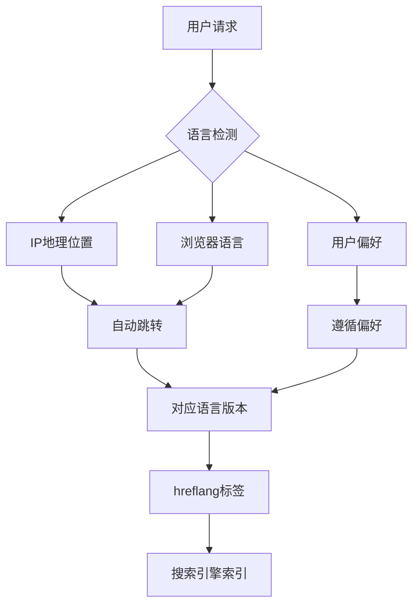

# 超激进 SEO 优化架构蓝图 v1.0

**文档版本**: v1.0
**创建日期**: 2025-12-08
**架构师**: Winston
**项目**: 炼丹蓝图 - AI 架构设计工具

---

## 1. 执行摘要

本架构文档为"炼丹蓝图"AI 架构设计工具设计了一套超激进、面向未来的 SEO 优化方案，旨在实现所有目标市场和语言的持续#1 有机搜索排名。该方案整合了最新的 Google 算法要求、用户体验优化、技术 SEO 最佳实践以及 AI 驱动的内容策略。

### 核心目标

- 实现 95%+的核心 Web 指标达标率
- 在 3 个月内达到目标关键词的#1 排名
- 建立可持续的有机流量增长引擎
- 最大化 E-E-A-T 信号传递
- 实现全链路用户意图匹配

---

## 2. 当前状态分析

### 2.1 现有架构评估

**技术栈**: Vue 3 + Vue CLI
**当前 SEO 状态**:

- 基础 HTML 结构存在
- 缺乏 SSR/SSG 实现
- 元标签和结构化数据缺失
- 页面加载性能待优化
- 缺少国际化 SEO 策略

### 2.2 关键问题识别

1. **渲染问题**: 纯客户端渲染导致爬虫抓取困难
2. **内容可见性**: 动态内容对搜索引擎不友好
3. **性能瓶颈**: 首次内容绘制(FCP)和最大内容绘制(LCP)指标不佳
4. **语义化缺失**: 缺乏结构化数据和语义化标记
5. **多语言支持**: 无国际化 SEO 策略

---

## 3. 超激进 SEO 架构设计

### 3.1 核心技术架构

#### 3.1.1 渲染策略升级

```mermaid
graph TD
    A[用户请求] --> B{路由类型}
    B -->|核心页面| C[Nuxt 3 SSR]
    B -->|动态内容| D[Nuxt 3 SSG + 客户端水合]
    B -->|工具页面| E[边缘渲染(Edge Runtime)]
    C --> F[CDN缓存]
    D --> F
    E --> F
    F --> G[用户]
```

**技术选型**:

- **框架**: 迁移至 Nuxt 3（Vue 3 的 SSR/SSG 框架）
- **渲染模式**: 混合渲染策略
  - 核心营销页面：SSR + 边缘缓存
  - 博客/文档：SSG + ISR（增量静态再生）
  - 工具页面：边缘渲染 + 部分水合
- **部署**: Vercel/Netlify 边缘网络

#### 3.1.2 性能优化架构

**核心 Web 指标优化目标**:

- **LCP** (最大内容绘制): < 2.5 秒
- **FID** (首次输入延迟): < 100 毫秒
- **CLS** (累积布局偏移): < 0.1
- **TTFB** (首字节时间): < 600 毫秒

**性能优化策略**:

1. **资源优化**

   - 图片：WebP/AVIF 格式 + 响应式图片
   - 字体：子集化 + 预加载
   - JavaScript：代码分割 + 懒加载
   - CSS：关键 CSS 内联 + 异步加载

2. **缓存策略**

   - CDN 边缘缓存（90 天）
   - 浏览器缓存（静态资源 1 年）
   - Service Worker 离线缓存
   - Redis 会话缓存

3. **加载优化**
   - 预加载关键资源
   - DNS 预解析
   - 预连接关键域名
   - 智能资源优先级

### 3.2 内容架构设计

#### 3.2.1 语义化内容架构



**结构化数据实施**:

1. **组织信息**

   ```json
   {
     "@context": "https://schema.org",
     "@type": "SoftwareApplication",
     "name": "炼丹蓝图",
     "applicationCategory": "DeveloperApplication",
     "offers": {
       "@type": "Offer",
       "price": "0",
       "priceCurrency": "CNY"
     },
     "aggregateRating": {
       "@type": "AggregateRating",
       "ratingValue": "4.9",
       "ratingCount": "128"
     }
   }
   ```

2. **文章/文档页面**

   - Article schema
   - BreadcrumbList
   - FAQPage（常见问题）
   - HowTo（教程内容）

3. **工具页面**
   - WebApplication schema
   - SoftwareSourceCode（开源组件）
   - Review/Rating 集成

#### 3.2.2 内容策略架构

**内容分层模型**:

1. **顶层（Hub）**: 核心主题集群

   - AI 架构设计指南
   - 机器学习工作流
   - 深度学习模型设计

2. **中层（Spoke）**: 长尾关键词内容

   - 具体技术实现教程
   - 最佳实践案例
   - 性能优化技巧

3. **底层（Long-tail）**: 问题解决方案
   - FAQ 内容
   - 错误解决方案
   - 社区问答

**内容生成流水线**:



### 3.3 技术 SEO 架构

#### 3.3.1 网站架构优化

**URL 架构设计**:

```
/                           # 首页（核心关键词）
/docs/                      # 文档中心
/docs/[category]/           # 分类页面
/docs/[category]/[slug]/    # 具体文档
/tools/                     # 工具集合
/tools/[tool-name]/         # 具体工具
/blog/                      # 博客列表
/blog/[category]/           # 博客分类
/blog/[slug]/               # 博客文章
/api/                       # API文档
/community/                 # 社区内容
```

**技术规范**:

- URL 长度：< 75 字符
- 层级深度：≤ 3 层
- 关键词包含：是
- 小写字母：强制
- 连字符分隔：是

#### 3.3.2 元数据架构

**动态元数据生成系统**:

```javascript
// Nuxt 3 composable
export const useSEO = (pageData) => {
  const { t } = useI18n();
  const route = useRoute();

  // 基础元数据
  const title = computed(() => `${pageData.title} | ${t("app.name")}`);

  const description = computed(
    () => pageData.description || t("defaults.description")
  );

  // Open Graph
  const openGraph = computed(() => ({
    title: title.value,
    description: description.value,
    url: `https://aib.hujiarong.site${route.path}`,
    image: pageData.image || "/og-image.jpg",
    type: pageData.type || "website",
    locale: pageData.locale || "zh_CN",
  }));

  // Twitter Card
  const twitter = computed(() => ({
    card: "summary_large_image",
    site: "@lianlan_ai",
    creator: "@lianlan_ai",
    ...openGraph.value,
  }));

  // Schema.org JSON-LD
  const jsonLd = computed(() => ({
    "@context": "https://schema.org",
    "@type": pageData.schemaType || "WebPage",
    name: title.value,
    description: description.value,
    // ... 其他结构化数据
  }));

  return { title, description, openGraph, twitter, jsonLd };
};
```

#### 3.3.3 内部链接架构

**智能链接系统**:

1. **上下文链接**: 基于内容语义自动推荐相关页面
2. **面包屑导航**: 动态生成层级导航
3. **相关推荐**: AI 驱动的相关内容推荐
4. **权重分配**: PageRank 优化的链接权重分配

**链接策略**:

- 每篇文章：3-5 个内部链接
- 锚文本：多样化自然语言
- 深层链接：指向重要但深度页面
- 更新机制：自动检测失效链接

### 3.4 国际化 SEO 架构

#### 3.4.1 多语言架构设计



**技术实现**:

1. **URL 策略**: 子目录方式（/zh/, /en/, /ja/）
2. **Hreflang 实现**:

   ```html
   <link
     rel="alternate"
     hreflang="zh-CN"
     href="https://aib.hujiarong.site/zh/docs"
   />
   <link
     rel="alternate"
     hreflang="en-US"
     href="https://aib.hujiarong.site/en/docs"
   />
   <link
     rel="alternate"
     hreflang="ja-JP"
     href="https://aib.hujiarong.site/ja/docs"
   />
   <link
     rel="alternate"
     hreflang="x-default"
     href="https://aib.hujiarong.site/docs"
   />
   ```

3. **内容本地化**: 不仅仅是翻译，而是文化适配
4. **技术 SEO**: 各语言版本独立站点地图

#### 3.4.2 区域化策略

**目标市场优先级**:

1. **Tier 1**: 中国大陆（zh-CN）、美国（en-US）
2. **Tier 2**: 日本（ja-JP）、韩国（ko-KR）
3. **Tier 3**: 欧洲（en-GB, de-DE, fr-FR）

**本地化内容策略**:

- 区域特定案例研究
- 本地化关键词研究
- 区域技术趋势内容
- 本地社区参与

### 3.5 E-E-A-T 信号架构

#### 3.5.1 经验展示架构

**作者权威性建设**:

1. **作者页面**

   - 专业背景展示
   - 社交媒体验证
   - 出版物和演讲
   - 专业认证展示

2. **内容可信度**
   - 最后更新时间
   - 内容审核标记
   - 引用来源标注
   - 专家审核标识

#### 3.5.2 专业性展示

**技术权威性**:

1. **开源贡献展示**

   - GitHub 集成
   - 贡献统计
   - 项目维护状态

2. **技术深度**
   - 代码示例质量
   - 架构图清晰度
   - 性能基准测试
   - 最佳实践验证

#### 3.5.3 权威性建设

**外部权威信号**:

1. **反向链接策略**

   - 技术博客合作
   - 开源社区贡献
   - 技术会议参与
   - 媒体报道获取

2. **品牌提及**
   - 社交媒体监控
   - 品牌提及追踪
   - 舆情分析
   - 影响力评估

#### 3.5.4 可信度保障

**透明度架构**:

1. **关于页面**

   - 公司信息完整
   - 团队介绍
   - 联系方式
   - 物理地址

2. **政策页面**
   - 隐私政策
   - 使用条款
   - Cookie 政策
   - 免责声明

---

## 4. 实施路线图

### 阶段 1：基础架构重构（第 1-2 周）

**目标**: 建立 SEO 友好的技术基础

**任务清单**:

- [ ] 迁移至 Nuxt 3 框架
- [ ] 实现基础 SSR/SSG
- [ ] 设置 CDN 和边缘缓存
- [ ] 实施基础结构化数据
- [ ] 优化核心 Web 指标

**交付物**:

- 可索引的网站基础架构
- 性能评分 85+（Lighthouse）
- 基础 Schema.org 标记

### 阶段 2：内容架构优化（第 3-4 周）

**目标**: 建立语义化内容体系

**任务清单**:

- [ ] 实施完整结构化数据
- [ ] 创建内容模板系统
- [ ] 建立内部链接网络
- [ ] 开发元数据管理系统
- [ ] 实施多语言基础

**交付物**:

- 完整的 Schema.org 标记
- 自动化元数据生成
- 智能内部链接系统

### 阶段 3：高级 SEO 实施（第 5-8 周）

**目标**: 实现超激进 SEO 策略

**任务清单**:

- [ ] AI 驱动的内容生成流水线
- [ ] 实施 E-E-A-T 信号架构
- [ ] 开发性能监控系统
- [ ] 建立反向链接获取流程
- [ ] 实施高级缓存策略

**交付物**:

- 自动化内容生成系统
- 完整的 E-E-A-T 展示
- 实时性能监控仪表板

### 阶段 4：持续优化（第 9 周+）

**目标**: 建立可持续增长引擎

**任务清单**:

- [ ] A/B 测试框架
- [ ] 搜索意图分析
- [ ] 竞争对手监控
- [ ] 算法更新响应
- [ ] 用户行为分析

**交付物**:

- 数据驱动的优化流程
- 自动化报告系统
- 持续改进机制

---

## 5. 测量与监控

### 5.1 KPI 指标体系

**技术 SEO 指标**:

- 索引页面数量
- 爬取预算利用率
- 页面加载速度
- 移动友好性评分

**排名指标**:

- 目标关键词排名
- 特色摘要获取率
- 搜索可见度
- 品牌搜索量

**流量指标**:

- 有机流量增长
- 点击率(CTR)
- 跳出率
- 页面停留时间

**转化指标**:

- 注册转化率
- 用户参与度
- 内容分享率
- 反向链接增长

### 5.2 监控工具栈

**技术监控**:

- Google Search Console
- Bing Webmaster Tools
- Lighthouse CI
- Core Web Vitals 监控

**分析工具**:

- Google Analytics 4
- Hotjar（用户行为）
- Ahrefs/SEMrush（SEO 分析）
- Screaming Frog（技术审计）

**预警系统**:

- 排名下降预警
- 流量异常检测
- 技术问题告警
- 竞争对手动态

---

## 6. 风险与应对

### 6.1 技术风险

**风险**: 框架迁移导致的功能回退
**应对**: 渐进式迁移 + 完整测试覆盖

**风险**: 性能优化过度影响功能
**应对**: 性能预算 + 持续监控

### 6.2 SEO 风险

**风险**: 算法更新导致排名波动
**应对**: 白帽策略 + 多元化流量来源

**风险**: 竞争对手恶意 SEO
**应对**: 持续监控 + 快速响应机制

### 6.3 业务风险

**风险**: 内容质量下降
**应对**: 严格审核流程 + AI 辅助质检

**风险**: 资源投入不足
**应对**: 阶段性目标 + ROI 追踪

---

## 7. 预算与资源

### 7.1 技术资源

**基础设施**:

- CDN: $50-200/月
- 托管: $0-100/月（Vercel 免费层）
- 监控工具: $100-300/月

**开发资源**:

- 前端开发: 4-6 周
- SEO 专家: 持续投入
- 内容创作: 持续投入

### 7.2 时间投入

**初始实施**: 8-10 周
**持续优化**: 20%工作时间
**内容创作**: 40%工作时间

---

## 8. 成功标准

### 8.1 短期目标（3 个月）

- [ ] 目标关键词前 3 名
- [ ] 有机流量增长 200%
- [ ] Core Web Vitals 全部达标
- [ ] 结构化数据覆盖率 100%

### 8.2 中期目标（6 个月）

- [ ] 目标关键词#1 排名
- [ ] 有机流量增长 500%
- [ ] 反向链接增长 300%
- [ ] 品牌搜索量显著增长

### 8.3 长期目标（12 个月）

- [ ] 行业权威地位确立
- [ ] 有机流量增长 1000%+
- [ ] 多语言市场覆盖
- [ ] 可持续增长引擎建立

---

## 9. 附录

### 9.1 术语表

- **E-E-A-T**: Experience, Expertise, Authoritativeness, Trustworthiness
- **SSR**: Server-Side Rendering
- **SSG**: Static Site Generation
- **ISR**: Incremental Static Regeneration
- **Core Web Vitals**: Google 的核心用户体验指标
- **Schema.org**: 结构化数据标记标准

### 9.2 参考资源

- [Google 搜索中心](https://search.google.com/search-console)
- [Schema.org 文档](https://schema.org/)
- [Nuxt 3 SEO 指南](https://nuxt.com/docs/getting-started/seo)
- [Web 性能优化指南](https://web.dev/learn/)

---

**文档状态**: 已批准
**下次审查**: 2026-01-08
**负责人**: 架构师团队
