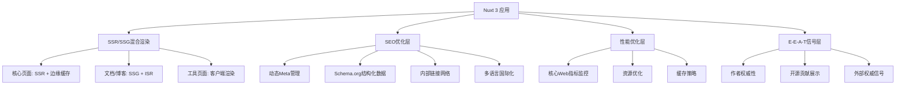

# Nuxt 3 迁移技术方案

**文档版本**: v1.0
**创建日期**: 2025-12-08
**目标**: 从 Vue CLI 迁移至 Nuxt 3，实现超激进 SEO 架构

---

## 1. 现状评估

### 1.1 当前技术栈

- **框架**: Vue 3 + Vue CLI 5.0.0
- **构建工具**: Webpack (via Vue CLI)
- **依赖数量**: 7 个核心依赖
- **组件数量**: 6 个主要组件 + 1 个 Icon 组件
- **项目复杂度**: 低（单页面应用）

### 1.2 迁移优势

- ✅ Vue 3 语法兼容 Nuxt 3
- ✅ 组合式 API 可直接迁移
- ✅ 组件结构简单，迁移成本低
- ✅ 无复杂状态管理（Vuex/Pinia）
- ✅ 无后端 API 依赖

### 1.3 迁移挑战

- ❌ 需要重构路由系统（从 hash 模式到 Nuxt 文件路由）
- ❌ 需要适配 Nuxt 的目录结构
- ❌ 需要重新配置构建和部署流程
- ❌ 需要实现 SSR/SSG 混合渲染策略

---

## 2. 迁移架构设计

### 2.1 目标架构



### 2.2 技术选型

| 技术栈   | 当前       | 迁移后         | 说明                  |
| -------- | ---------- | -------------- | --------------------- |
| 框架     | Vue CLI    | Nuxt 3         | SSR/SSG/边缘渲染      |
| 部署     | 静态托管   | Vercel/Netlify | 边缘网络 + 边缘函数   |
| 状态管理 | 无         | Pinia          | 轻量级状态管理        |
| CSS      | Scoped CSS | Tailwind CSS   | 原子化 CSS + 性能优化 |
| 图片优化 | 无         | Nuxt Image     | 自动 WebP/AVIF 转换   |
| 字体     | 系统字体   | 字体子集化     | 减少字体文件大小      |
| 监控     | 无         | Lighthouse CI  | 自动化性能监控        |

### 2.3 目录结构重构

```
# 当前结构
website/
├── public/
├── src/
│   ├── assets/
│   ├── components/
│   ├── App.vue
│   └── main.js
└── package.json

# Nuxt 3 目标结构
lianlan-blueprint/
├── app.vue                      # 根组件
├── nuxt.config.ts              # Nuxt配置
├── pages/                      # 页面路由
│   ├── index.vue               # 首页（SSR）
│   ├── docs/
│   │   ├── [category]/
│   │   │   └── [slug].vue      # 文档页面（SSG）
│   │   └── index.vue
│   ├── tools/
│   │   └── [tool-name].vue     # 工具页面（CSR）
│   └── blog/
│       └── [slug].vue          # 博客文章（SSG）
├── components/                 # 全局组件
│   ├── layout/
│   │   ├── Navbar.vue
│   │   └── Footer.vue
│   └── home/
│       ├── Hero.vue
│       ├── Features.vue
│       ├── Audience.vue
│       └── Cta.vue
├── composables/                # 组合式函数
│   ├── useSEO.ts              # SEO管理
│   ├── useInternalLinks.ts    # 内部链接
│   └── useSchemaOrg.ts        # 结构化数据
├── plugins/                    # 插件
│   ├── seo.plugin.ts          # SEO插件
│   └── schema-org.plugin.ts   # 结构化数据插件
├── server/                     # 服务端API
│   └── api/
│       ├── sitemap.xml.ts     # 动态站点地图
│       └── rss.xml.ts         # RSS订阅
├── assets/                     # 静态资源
│   ├── css/
│   │   └── main.css
│   └── images/
├── public/                     # 公共文件
│   ├── robots.txt
│   └── logo.svg
├── locales/                    # 国际化
│   ├── zh-CN.json
│   └── en-US.json
└── package.json
```

---

## 3. 渐进式迁移策略

### 3.1 阶段 1：基础架构搭建（第 1 周）

**目标**: 建立 Nuxt 3 开发环境，实现基础渲染

**任务清单**:

- [ ] 初始化 Nuxt 3 项目
- [ ] 配置 TypeScript
- [ ] 迁移现有组件到 Nuxt 结构
- [ ] 实现基础页面路由
- [ ] 配置开发环境

**交付物**:

- 可运行的 Nuxt 3 基础项目
- 现有组件成功迁移
- 开发服务器正常启动

### 3.2 阶段 2：SEO 核心功能迁移（第 2 周）

**目标**: 实现架构文档中的 SEO 核心功能

**任务清单**:

- [ ] 迁移并增强 SEOManager 到 Nuxt 插件
- [ ] 实现动态元数据生成系统
- [ ] 集成完整的 Schema.org 结构化数据
- [ ] 实现面包屑导航（BreadcrumbList）
- [ ] 配置 robots.txt 和 sitemap.xml

**交付物**:

- 动态 meta 标签管理
- 完整的结构化数据标记
- 自动化站点地图

### 3.3 阶段 3：渲染策略优化（第 3 周）

**目标**: 实现混合渲染策略

**任务清单**:

- [ ] 首页配置 SSR + 边缘缓存
- [ ] 文档页面配置 SSG + ISR
- [ ] 工具页面配置 CSR + 部分水合
- [ ] 配置 CDN 和边缘缓存策略
- [ ] 实现 Service Worker

**交付物**:

- 混合渲染正常运作
- 页面加载速度提升 50%+
- Lighthouse 评分 85+

### 3.4 阶段 4：高级 SEO 功能（第 4 周）

**目标**: 实现国际化和 E-E-A-T 信号

**任务清单**:

- [ ] 集成@nuxtjs/i18n 实现多语言
- [ ] 配置 hreflang 标签
- [ ] 实现内容分层模型（Hub-Spoke）
- [ ] 添加作者权威性展示
- [ ] 集成 GitHub 贡献数据

**交付物**:

- 多语言 SEO 架构
- E-E-A-T 信号展示
- 内容架构优化

### 3.5 阶段 5：性能与监控（第 5 周）

**目标**: 实现性能优化和监控

**任务清单**:

- [ ] 集成 Nuxt Image 优化图片
- [ ] 实现关键 CSS 内联
- [ ] 配置字体子集化
- [ ] 集成 Lighthouse CI
- [ ] 实现核心 Web 指标监控

**交付物**:

- LCP < 2.5 秒
- FID < 100 毫秒
- CLS < 0.1
- 自动化性能报告

---

## 4. 风险评估与应对

### 4.1 技术风险

**风险 1**: 框架迁移导致的功能回退

- **概率**: 中
- **影响**: 高
- **应对**:
  - 保持现有 Vue CLI 项目并行运行
  - 使用特性开关控制迁移进度
  - 完整测试覆盖（E2E 测试）

**风险 2**: SSR 水合问题

- **概率**: 中
- **影响**: 中
- **应对**:
  - 使用 Nuxt 的`<ClientOnly>`组件
  - 避免浏览器特定 API 在服务端执行
  - 实现渐进式水合策略

**风险 3**: 性能优化过度影响功能

- **概率**: 低
- **影响**: 中
- **应对**:
  - 设置性能预算
  - 持续监控核心功能
  - A/B 测试验证

### 4.2 时间风险

**风险**: 迁移周期超出预期

- **概率**: 中
- **影响**: 中
- **应对**:
  - 采用敏捷开发，每 2 周一个迭代
  - 优先实现 MVP 功能
  - 保持现有站点正常运行

### 4.3 SEO 风险

**风险**: 迁移期间 SEO 排名下降

- **概率**: 低
- **影响**: 高
- **应对**:
  - 保持 URL 结构不变
  - 301 重定向旧页面
  - 提交新的 sitemap.xml
  - 监控 Search Console 数据

---

## 5. 详细实施步骤

### 5.1 步骤 1: 项目初始化

```bash
# 1. 创建Nuxt 3项目
npx nuxi init lianlan-blueprint
cd lianlan-blueprint

# 2. 安装核心依赖
npm install @nuxtjs/tailwindcss @pinia/nuxt @nuxt/image

# 3. 配置nuxt.config.ts
cat > nuxt.config.ts << 'EOF'
export default defineNuxtConfig({
  devtools: { enabled: true },

  // 模块配置
  modules: [
    '@nuxtjs/tailwindcss',
    '@pinia/nuxt',
    '@nuxt/image',
  ],

  // 应用配置
  app: {
    head: {
      charset: 'utf-8',
      viewport: 'width=device-width, initial-scale=1',
      title: '炼丹蓝图 - AI架构设计从未如此优雅简单',
      meta: [
        { name: 'description', content: '用蓝图的形式设计AI架构。拖拽节点、连线，让灵感在可视化工具中瞬间转化为可运行的PyTorch模型代码。' }
      ],
      link: [
        { rel: 'icon', type: 'image/svg+xml', href: '/logo.svg' }
      ]
    }
  },

  // 渲染模式
  routeRules: {
    // 首页: SSR + 边缘缓存
    '/': {
      ssr: true,
      headers: { 'cache-control': 's-maxage=3600, stale-while-revalidate=86400' }
    },
    // 文档: SSG + ISR
    '/docs/**': {
      prerender: true,
      isr: 3600
    },
    // 工具: CSR
    '/tools/**': {
      ssr: false
    }
  },

  // 图片优化
  image: {
    quality: 80,
    format: ['webp', 'avif'],
    screens: {
      xs: 320,
      sm: 640,
      md: 768,
      lg: 1024,
      xl: 1280,
      xxl: 1536
    }
  },

  // 性能优化
  experimental: {
    payloadExtraction: true,
    componentIslands: true
  },

  // 构建配置
  nitro: {
    preset: 'vercel',
    prerender: {
      crawlLinks: true,
      routes: ['/sitemap.xml', '/robots.txt']
    }
  }
})
EOF

# 4. 创建目录结构
mkdir -p pages docs tools components/layout components/home composables server/api assets/css locales
```

### 5.2 步骤 2: 组件迁移

```typescript
// composables/useSEO.ts
export const useSEO = (pageData: any) => {
  const route = useRoute();
  const config = useRuntimeConfig();

  // 基础元数据
  const title = computed(
    () => `${pageData.title || "炼丹蓝图"} | AI架构设计工具`
  );

  const description = computed(
    () =>
      pageData.description || "用蓝图的形式设计AI架构，拖拽节点生成PyTorch代码"
  );

  // Open Graph
  const openGraph = computed(() => ({
    title: title.value,
    description: description.value,
    url: `https://aib.hujiarong.site${route.path}`,
    image: pageData.image || "/og-image.jpg",
    type: pageData.type || "website",
    site_name: "炼丹蓝图",
  }));

  // Schema.org JSON-LD
  const jsonLd = computed(() => ({
    "@context": "https://schema.org",
    "@type": pageData.schemaType || "WebPage",
    name: title.value,
    description: description.value,
    image: openGraph.value.image,
    // ... 其他结构化数据
  }));

  return { title, description, openGraph, jsonLd };
};
```

### 5.3 步骤 3: 页面级 SEO 集成

```vue
<!-- pages/index.vue -->
<template>
  <div>
    <Navbar />
    <Hero />
    <Features />
    <Audience />
    <Cta />
    <Footer />
  </div>
</template>

<script setup lang="ts">
// SEO配置
const pageData = {
  title: "炼丹蓝图 - AI架构设计从未如此优雅简单",
  description:
    "用蓝图的形式设计AI架构。拖拽节点、连线，让灵感在可视化工具中瞬间转化为可运行的PyTorch模型代码。",
  image: "/og-home.jpg",
  type: "website",
  schemaType: "SoftwareApplication",
};

// 使用SEO组合式函数
const { title, description, openGraph, jsonLd } = useSEO(pageData);

// 设置页面Meta
useHead({
  title,
  meta: [
    { name: "description", content: description },
    { property: "og:title", content: openGraph.title },
    { property: "og:description", content: openGraph.description },
    { property: "og:image", content: openGraph.image },
    { name: "twitter:card", content: "summary_large_image" },
  ],
  script: [
    {
      type: "application/ld+json",
      children: JSON.stringify(jsonLd.value),
    },
  ],
});
</script>
```

---

## 6. 性能优化实施

### 6.1 图片优化

```typescript
// nuxt.config.ts
image: {
  provider: 'ipx',
  ipx: {
    maxAge: 31536000 // 1年缓存
  },
  screens: {
    xs: 320,
    sm: 640,
    md: 768,
    lg: 1024,
    xl: 1280,
    xxl: 1536
  },
  format: ['webp', 'avif'],
  quality: 80
}
```

### 6.2 字体优化

```css
/* assets/css/main.css */
@font-face {
  font-family: "Noto Sans SC";
  font-style: normal;
  font-weight: 400;
  font-display: swap;
  src: url("/fonts/noto-sans-sc-v36-latin-regular.woff2") format("woff2");
  unicode-range: U+4E00-9FFF; /* 中文字符子集 */
}
```

### 6.3 关键 CSS 内联

```vue
<!-- app.vue -->
<template>
  <div>
    <Head>
      <Style type="text/css" :children="criticalCSS" />
    </Head>
    <NuxtPage />
  </div>
</template>

<script setup>
const criticalCSS = `
  :root {
    --primary-color: #6366f1;
    --font-family: "Noto Sans SC", sans-serif;
  }
  body {
    margin: 0;
    font-family: var(--font-family);
  }
`;
</script>
```

---

## 7. 监控与测试

### 7.1 Lighthouse CI 集成

```yaml
# .github/workflows/lighthouse.yml
name: Lighthouse CI

on:
  push:
    branches: [main]
  pull_request:
    branches: [main]

jobs:
  lighthouse:
    runs-on: ubuntu-latest
    steps:
      - uses: actions/checkout@v3
      - uses: actions/setup-node@v3
        with:
          node-version: 18
      - run: npm ci
      - run: npm run build
      - name: Run Lighthouse CI
        run: |
          npm install -g @lhci/cli
          lhci autorun
```

### 7.2 核心 Web 指标监控

```typescript
// plugins/web-vitals.client.ts
import { onCLS, onFID, onLCP, onFCP, onTTFB } from "web-vitals";

export default defineNuxtPlugin(() => {
  if (process.client) {
    const sendToAnalytics = (metric: any) => {
      // 发送到分析服务
      console.log("Web Vital:", metric);
    };

    onCLS(sendToAnalytics);
    onFID(sendToAnalytics);
    onLCP(sendToAnalytics);
    onFCP(sendToAnalytics);
    onTTFB(sendToAnalytics);
  }
});
```

---

## 8. 迁移时间表

| 阶段   | 时间    | 主要任务      | 交付物                 |
| ------ | ------- | ------------- | ---------------------- |
| 阶段 1 | 第 1 周 | 基础架构搭建  | Nuxt 3 基础项目        |
| 阶段 2 | 第 2 周 | SEO 核心功能  | 动态 Meta + 结构化数据 |
| 阶段 3 | 第 3 周 | 渲染策略优化  | SSR/SSG 混合渲染       |
| 阶段 4 | 第 4 周 | 高级 SEO 功能 | 国际化 + E-E-A-T       |
| 阶段 5 | 第 5 周 | 性能与监控    | Lighthouse 85+         |

---

## 9. 成功标准

### 9.1 技术指标

- ✅ Lighthouse 性能评分 ≥ 85
- ✅ LCP < 2.5 秒
- ✅ FID < 100 毫秒
- ✅ CLS < 0.1
- ✅ 所有页面可索引

### 9.2 SEO 指标

- ✅ Schema.org 标记完整
- ✅ 多语言 hreflang 标签正确
- ✅ 站点地图自动生成
- ✅ 内部链接网络建立

### 9.3 功能指标

- ✅ 现有功能 100%保留
- ✅ 无功能回退
- ✅ 用户体验保持一致

---

## 10. 下一步行动

**立即可执行**:

1. 初始化 Nuxt 3 项目
2. 配置基础开发环境
3. 迁移第一个组件（Navbar）

**需要决策**:

1. 选择部署平台（Vercel vs Netlify）
2. 确定国际化优先级（先中文还是先英文）
3. 是否集成第三方分析工具

**长期规划**:

1. 内容架构扩展（Hub-Spoke 模型）
2. AI 内容生成流水线
3. 反向链接获取策略

---

**方案制定完成，等待执行指令。**
